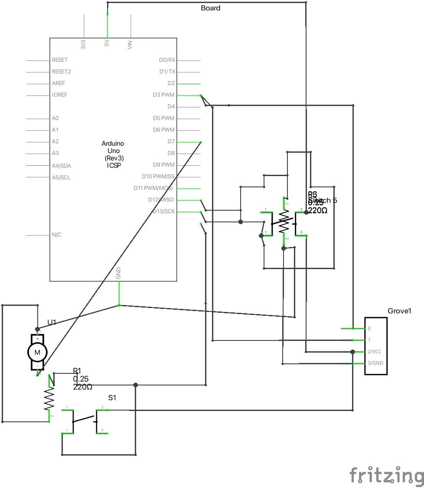
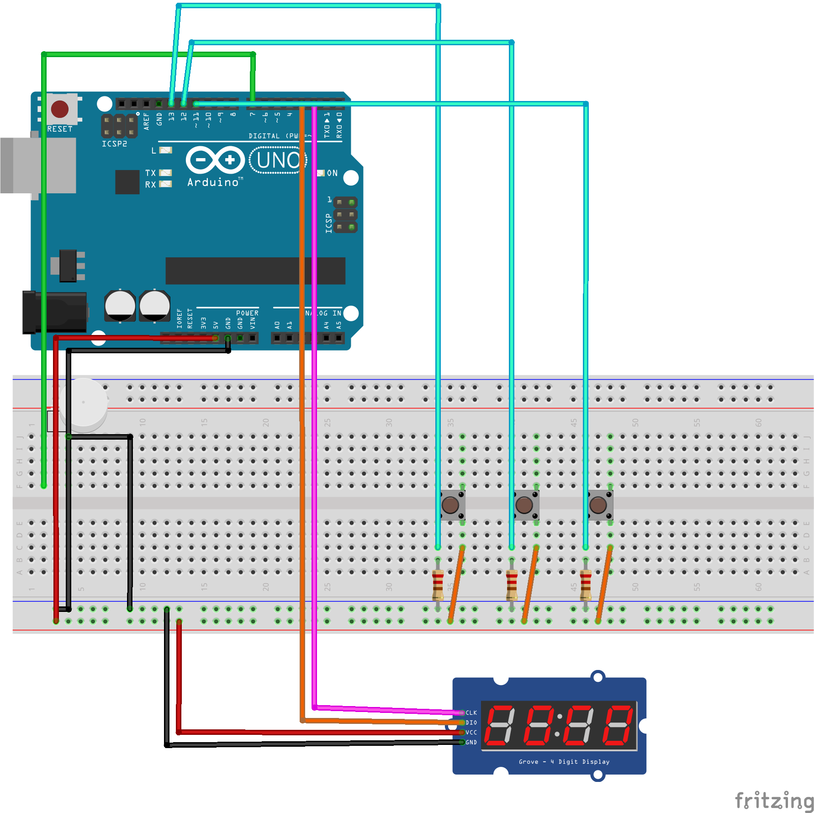

# :alarm_clock: AlarmSticker
*Wearable, **Stickable** Alarm Clock for Arduino*

### CODE
- [AlarmSticker.ino](./AlarmSticker/AlarmSticker.ino): Main Code

### CIRCUIT & IMAGE
- [Schematic](./Circuit_schem.png)

- [Breadboard](./Circuit_bb.png)

### LICENSE
Apache-2.0 License, check [LICENSE.md](./LICENSE.md) for more

> 2022, RedoC
